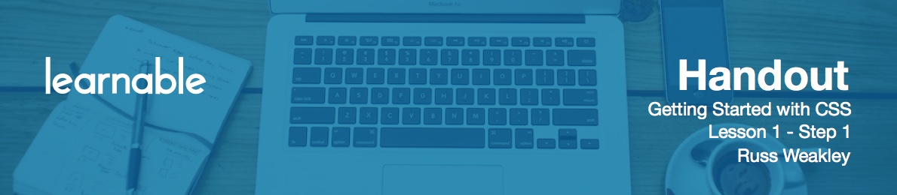

# Introduction

Hello! My name is Russ Weakley from Max Design. Welcome to Getting Started with CSS course. The aim of this course is to learn CSS from the absolute basics. With each lesson, we're going to look at one aspect of CSS and then do a series of exercises.

- In lesson one, we're going to look at some key definitions, and then how to apply CSS to web pages.
- In lesson two, we're going to look at how to write CSS rules.
- In lesson three, we're going to look at basic CSS selectors.
- In lesson four we will discuss CSS inheritance.
- Lesson five is about CSS cascade.
- Lesson six is devoted to block and inline elements.
- Lesson seven is all about CSS positioning.
- In lesson eight we will discuss CSS floats.
- Lesson nine is about CSS backgrounds.
- Lesson ten is the last lesson and is devoted to basic print CSS.

# What You Need For Course

To complete this course you only need two things:

- A text editor.
- A web browser. We're going to define modern browsers as anything above and equal to Internet Explorer 9, Chrome 12, Firefox 5, and Safari 5.1.

You can download all the exercises for the entire course via the Download zip button below this video, which is part of lesson 1.1. Then you can code along as we go.

Alternatively you can download just the exercises for any particular step of our lesson using the Download ZIP button below that relevant video.