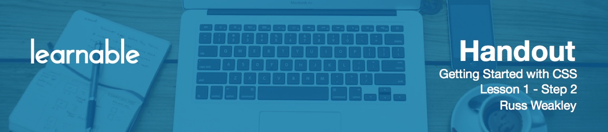

# Introduction

**CSS** stands for **Cascading Style Sheets**. These days, front-end web development normally involves three components.

- **HTML** is used to define the structure of the documents.
- **CSS** is used to define the appearance of the documents.
- **JavaScript** is often used to control how users interact with components on the page.

Before we get started on CSS, we're going to look at some commonly used terms and their definitions.

# HTML Elements

**HTML elements** are the building blocks of HTML markup, they help us define the content and the structure of web pages. HTML elements generally involve a start tag and an end tag:

```html
<p>Text</p>
```

The start tag in this example is the `<p>` and `</p>` is the end tag. 

There are some HTML elements that don't have an end tag and these are often called **void elements**. In HTML 4.01 to have valid documents, we used to write them without slashes:

```html
<br>
```

If you're writing in XHTML, you may have seen them written with a trailing slash at the end:

```html
<br/>
```

This was required, if you wanted your documents to be valid XHTML 1.0.

In HTML5, we can write them with or without trailing slashes.

# HTML Attributes

HTML attributes are used to assign additional properties to HTML elements.

```html
<p class="intro">Text</p>
```

The **attribute** is `class` and the **value** is `intro`. Attributes are always placed in the start tag or within the element. You can have as many attributes as you want inside any HTML element and they can be placed in any order.

Attribute values can be written inside double quotes, single quotes or even in some cases, using no quotes at all, although that should be used very sparingly, as you'll see in a second.

Some attributes allow us to define multiple values:

```html
<p class="intro highlight">Text</p>
```

There are some HTML attributes that don't require a value. These are called **boolean attributes** and here's a bunch of examples:

- checked
- disabled
- multiple
- read-only
- selected

Back in the HTML 4.01 days, we used to write `selected="selected"`. With HTML5, we can write them much simpler:

```html
<input type="radio" name="browser" value="ie" selected>
```

# The Document Tree

Let's now look at **HTML document trees**. All HTML documents contain document trees and they're made up from HTML elements.

```html
<html>
	<head></head>
	<body>
		<ul>
			<li>Text</li>
			<li>Text</li>
			<li>Text</li>
		</ul>
	</body>
</html>
```

CSS uses the document tree to select and style elements within the document. Within the document tree, the first type of element is called an **ancestor** and that is an element that is before or above a range of other elements. In this case, the `body` is an ancestor of the `ul` and the `li` elements.

The opposite also applies. The body `might` be an ancestor, but the `ul` and `li` are descendants of the `body`. The `body` is also a parent. In this case, it's a parent of the `ul` and the `ul` is a child of the `body`.

Then we have **siblings**. Siblings are any elements that are the same level that have the same parent. In this case, all three `li` elements have the same parent, so they're siblings. At any point, an element could be an ancestor, a descendent, a child, a parent or even a sibling.

# Block level and Inline Elements

**Block-level elements** are formatted visually as blocks, which means they sit one above of each other as they go down the page. Examples of block elements are

- `aside`
- `blockquote`
- `div`
- `footer`
- form elements
- all the heading elements and paragraphs

**Inline elements** are formatted with lines, so they don't form new blocks, like block-level elements. Some examples are

- `a`
- `br`
- `cite`
- `code`
- `em`
- `small`
- `strong`

A common term used in CSS is **containing box**. From CSS perspective, all elements are just a series of boxes and a containing box is just a box that contains other elements.

Another term that's commonly used is **line boxes**. If you have a paragraph of text that wraps as a series of lines, each of these lines sit in what's called a line box. Inside a line box, you might have inline elements, like a `strong` element, but you're also going to have pieces of text that aren't inline elements and they're anonymous boxes.They have no other purpose.

# User Agents

The term **user agents** was coined in the early days when the internet could only be navigated using the keyboard. Later on, tools were developed to be the users agent or acting on behalf of users, so that users didn't have to understand cryptic commands in order to retrieve information.

Today, nearly everyone uses a web browser as their user agent. However, user agents can include not only browsers, but media players, search engine bots and even things like assistive technologies.

# Viewport

The **viewport** is the viewing area within a browser window. This could be in a desktop environment, the browser window in a mobile environment - it could be in any type of device really. The viewing area within the browser window is called the viewport.