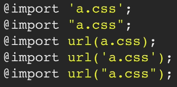

# Introduction @media method

The second method we'll look at is the `@import` method. `@import` rules can be written in five different ways, but they're all trying to achieve the same result.



We're trying to import another CSS file into the original CSS file. In all these examples, we're importing *a.css* into the CSS file.

# Exercise

For this exercise, we only need to look at two CSS files. The first one is print CSS and what we want to do is to write an `@import` rule to import this stylesheet into another one.

`@import` rules should be written in the very first line of your CSS, otherwise, they can be totally ignored.

```css
@import url(print.css) screen, print;
```

We set the media type as well. These rules aren't actually being imported into our *styles.css* file, but from a browsers perspective it's as if they were. Browsers will treat these add imports as if those rules were placed inside this original CSS file.