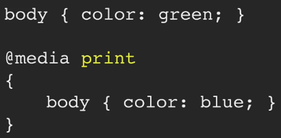

# Introduction @media method

The third method we're going to look at is `@media` rules. Here's an example CSS file:



We have two rules, both of them specify the color of the body. `@media` rules allow us to bundle up a whole series of CSS rules and apply different criteria to them. In this case we have the rule would only be applied by devices that are print-based. You can leave off the media type, and that defaults to the equivalent of `all`.

# Exercise

For this exercise,we're going to write a `@media` rule straight into our *styles.css* file:

```css
@media screen, print
{
	body { color: red; }
}
```