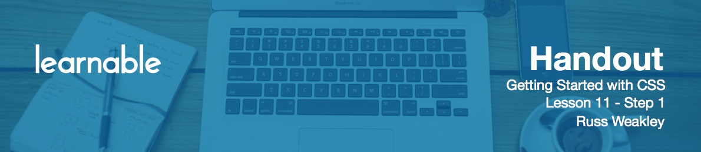

# Conclusion

This concludes the Getting Started with CSS course. Over ten lessons, we've covered quite a lot of various topics. Hopefully you've learned how to write CSS rules, CSS selectors, and you also understand inheritance in the cascade. You'd also have a solid understanding of block and inline elements, positioning in floats, and even a good understanding of background images in print CSS.

But your journey has only just begun. There's so much more to learn about CSS, so the question is what do I do next? I've added some notes to this course, and that'll allow you to do some extra reading and some extra learning on your own. But there are also a wide range of Learnable courses that you could take to further your knowledge of CSS. For example, two courses to start off with are CSS Troubleshooting in Six Easy Steps and Understanding the CSS Cascade. I also have three CSS selector courses including Getting Started, Targeting HTML Like a Pro, and Diving Deeper. If you want to get into responsive web design, I have two courses available online, Key Concepts and Responsive Web Design in Action.

So that's it. Thank you for taking part, and good luck on your journey!