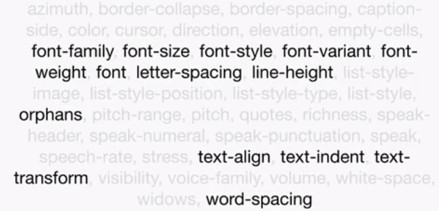
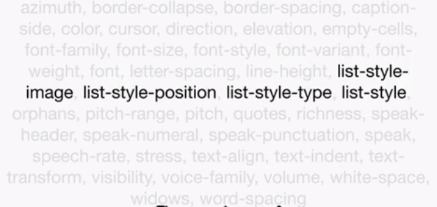
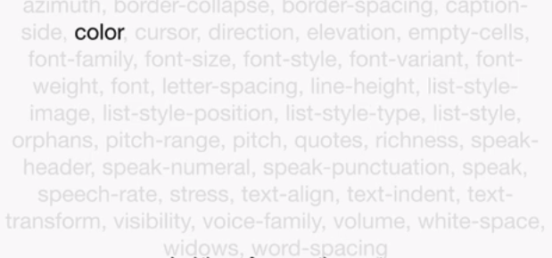

# CSS Properties

In CSS 2.1 many properties are inherited. Let's divide them intro groups.



The first group is text related properties.



The second group of properties that are inherited are list-style related properties.



And then of course, the most important is the `color` property.

But what about `font-size`? It is inherited in a different way to many other properties. By default, the `body` element has a `font-size` of approximately `16px`. But what would happen if we wrote a rule like this:

```css
p { font-size: 80%; }
```

The `p` element would be 80% of 16, which is `12.8px`. Now if the font size of 80% was inherited, the emphasis element inside the paragraph would be 80% of the paragraph element, which would mean it would be a font size of `10.24px`. However, this is not the case. The emphasis element will be same size as the paragraph element.

So basically the calculated value is inherited, rather than the value itself. So if the paragraph element is given a font size of `80%`, as we know that will be `12.8px`. This calculated value is then passed on to the emphasis element.

# Exercise

Write a simple rule inside *styles.css*:

```css
p { font-size: 200%; }
```

Reload the page and note that the paragraph's font size has increased, but the emphasis element has not become 200% of 200%.