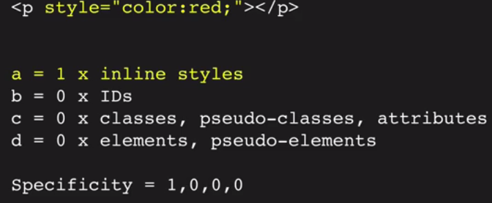

# Introduction

Welcome to lesson five! This lesson is all about the CSS cascade.

Before we look at the CSS cascade in detail, we need to talk about the `!important` declarations. Using them can define any declaration as more important than other declarations. Here is a brief example:

```css
p {color : red !important;}
```

The `!important` keyword must come before the semicolon.

# What is conflict?

User agents have to deal with CSS rules coming from three different origins:

- From user agents themselves, the users, and authors, or us.
- As well as that, browsers have to deal with CSS rules coming from different types of author stylesheets. That could be inline or header or external style sheets.
- Finally, browsers also have to deal with different types of declarations.

At some point browsers have to deal with declarations that conflict with one another. This happens when more than one declaration refers to the same element and property. In this case browsers need to determine which declarations will be applied to the HTML document. First of all, browsers have to gather all the declarations that apply to an element and a property from various origins.

# Sort by origin and importance

If there any conflicting declarations, they are sorted according to their origin, with their user-agent (user-author) and their importance (whether they're normal or important).

What happens if two declarations have the same origin and importance?Well in these cases, we proceed to step 3.

# Determince specificity

In this case declaration selectors need to be scored to see which one will win. Four scores are concatenated, or linked together as a chain, to create a final score. This score is referred to as a selector's specificity.



In the example above, we have the `style` attribute set to `color:red`. That would have a specificity for the column A of 1. There are no IDs, so column B gets 0. There are no classes, pseudo-class, so there's nothing in column C. And there are no elements or pseudo-elements,so there's nothing in column D.So this has a specificity of 1, 0, 0, 0, which is extremely high and beats pretty much everything else.

Column A almost always beats column B, which almost always beat column C, which almost always beats column D. So basically, classes will always beat elements, IDs will always beat classes, and generally speaking, inline styles will always beat IDs. 

# Determince order specified

If two selectors have the same importance, origin, and specificity, the declaration that appears last in document order will win.