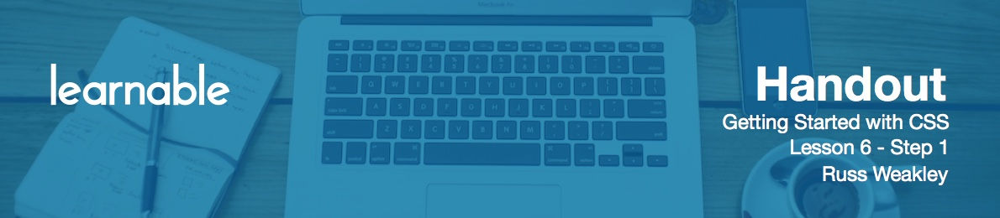

# Introduction

Welcome to lesson six! This lesson is all about block and inline elements.

# Block-level elements

First off, let's look at **block-level elements**. Block-level elements form visually as blocks, which means they flow down the page in what's called, normal flow. By default, block-level elements will stretch to the width of their parent container or the viewport. Width can be sized but cannot be collapsed.

The height of block-level elements is also collapsed. Their height can be sized but cannot be stretched.

Margins can be applied to all sides of block-level elements. Top and bottom margins will collapse when in contact with other block-level elements above or below.

Padding can be applied to all sides of block-level elements. It is being added to the overall width and height of block-level elements.

Borders can be applied to all size of block-level elements. Just like padding, border is added to the overall width and height of block level elements.

Overflow can be applied to block-level elements, using the `overflow` property. The default behavior is `overflow: visible`. This means that if the content is much deeper than the height of a container, it will just flow out of the container and be visible. You may use `overflow: hidden` to cut off any content that does not fit the dimensions of the container. We can also use `overflow: scroll`, and that adds scrollbars to the bottom and right side of the element. The last option is use `overflow: auto`. This, depending on the browser, will add scrollbars only to the affected axis meaning that, if the quantity is deeper than the parent, then the scrollbars will appear on the right. If the content is wider than the parent, the scrollbars would appear at the bottom.

One of the great things about CSS is we can take an element that's not a block-level element and make it appear like a block-level element. For example, we could take something like an emphasis element and set the following style:

```css
em { display: block }
```

It would behave just like any other block-level element. However, the important thing to understand is, it doesn't change it's semantics or its meaning, it just changes the way it's displayed.

# Exercise

Open up HTML and CSS files for this lesson.

There are already a couple of styles already defined setting the background of all test elements to yellow, margin to `1em` at the bottom. Also test elements 06, 07, 08 and 09 have their width set and are made floating. We'll be talking more about floats in our next lesson.

Let's write our first rule:

```css
.test01 { width: 200px; }
```

`test01` was stretched to the width of the viewport, however, when you reload the page, you'll see that now it is being set with a width.

The next rules:

```css
.test02 { height: 60px; }
.test03 { margin: 2em; }
```

Element 02 now has height defined and element 03 has a margin that will push it away from all the other elements.

```css
.test04 { padding: 2em; }
.test05 { border: 1em solid red; }
```

These styles will add padding all around the element and put a big, thick border around the element 05 element.

```css
.test06 { overflow: visible; }
```

This will won't do any difference at all, because we're actually setting to the default value.

```css
.test07 { overflow: hidden; }
.test08 { overflow: scroll; }
.test09 { overflow: auto; }
```

The content in element 07 will be hidden once it reaches the edge of the container. That content still exists, it just can't be seen. For element 08 a scrollbar will be added, even though the content hasn't extended outside the container. For element 09 the scrollbar has only been added to the side where it's required.