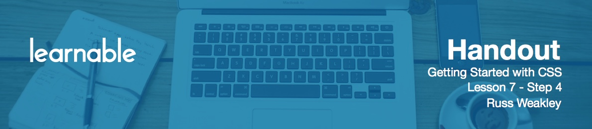

# Fixed Positioning

Now let's look at **fixed positioning** that can be written with

```css
div {position: fixed}
```

When given a fixed positioning, an element will move up off the page. In flow content that comes after the fixed position element will ignore that element and re-flow accordingly. By default, elements with fixed positioning have auto height and width, so their width and height will shrink wrap around the content. These elements can be given a width and a height, which means they can become sized.

Fixed position elements can also be stretched. If a fixed position element is set to `left:0` and `right:0`, it will stretch to fit the width of the viewport. If a fixed positioned element is set to `top:0` and `bottom:0`, it will stretch to fit the height of the viewport. If the properties `left`, `right`, `top` and `bottom` are not applied to a fixed positioned element, it'll remain in its current position, sitting above the page.

Fixed position elements are positioned relative to the viewport. They'll remain in the same position, even if the page is scrolled.

# Exercise

Assign `h2` with positioning:

```css
h2 { position: fixed; }
```

The content below `h2` is shifted up, because the element has moved off the page. This element also has shrink wrapped.

```css
h2 { left: 20px; }
```

`h2` is moved right off to the left and positioned itself 20px away from the left edge of the viewport. If we scroll, the element will remain fixed in place, relative to the viewport.

```css
h2 { top: 20px; }
```

It will position itself from the very top left corner of the page, 20px down.

```css
h2 {
	left: 0;
	right: 0;
}
```

`h2` will be stretched right across the page.

```css
h2 { width: 300px; }
```

Width will be set accordingly.