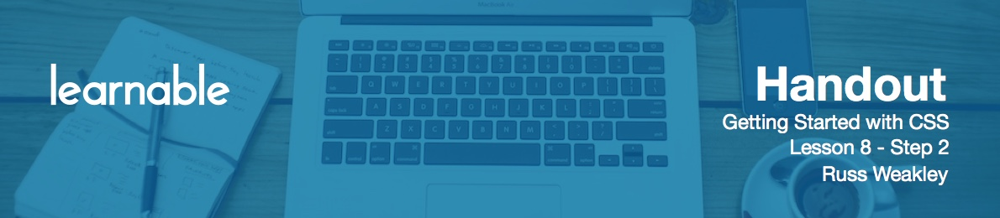

# Floating a Block-level Element

Let's talk about floating block and inline elements.

As you know from previous lessons, block-level elements, by default, will stretch to the width of viewport or the parent container. However, as soon as you fly a float to a block-level element, it becomes a **float box**.

By default, float boxes don't have a width. The width rule collapse or shrink wrap to the width of the widest content inside. So in this example, you can see that our heading has shrink wrapped from a full width heading down to the text just saying Heading.Now, as soon as you apply a width to a floated element it will cease to be collapsed or shrink wrapped and become sized.

# Exercise

We're going to float the `h2` and see what happens:

```css
h2 { float: left; }
```

You will see that the `h2` element changes from a block-level element, which is stretched to the width of the parent container, and now shrink wraps, so it moves out of flow, it shifts to the left, and then shrink wraps. The paragraph, which is sitting below normally, will now slide up underneath that floated element. We can test that by adding a border to the paragraph:

```css
p { border: 5 px solid blue; }
```

Why is the `h2` sitting slightly down? The reason is its got a bit of default margin above and below, and we can turn that off now:

```css
h2 { margin: 0 }
```

Can we give this floated item a width?

```css
h2 { width: 300px; }
```

The floated item now stretches out to a width of 300px.