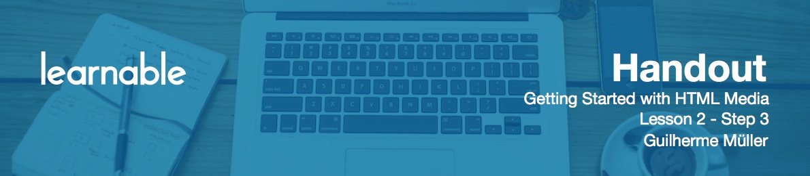

# Introduction

In this lesson, I'm going to show you some recommendations for video software and plugins, so you can convert various kinds of video and display them on a web page using custom video players that are robust and provide cross-browser support.

# Video Software

Before you can embed video using the `video` tag, it's important that you have the files in an least two formats, like MP4 and Ogg video, or MP4 and WebM. That's because some browsers do not support Ogg or WebM while supporting MP4, and vice versa.

We will discuss a free tool called Freemake Video Converter. Access the link in the lesson notes, download and install this program. When installing, be careful, because it will try to install unnecessary software at every turn.

This software has many conversion options and one of them is HTML5. It will convert video to three different formats and also provide a sample HTML file with the `video` tag in it.

There's another popular free converter called Miro Video Converter that you can check out as well.

# Custom Video Controls

Now, we are going to take a look at two plugins that implement custom video controls. The first one is called Video.js. Open the *videojs.html* file before proceeding.

The first thing we need to do is to load the CSS and JS files that come with the plugin:

```html
<link rel="stylesheet" href="video-js/video-js.min.css">
<script src="video-js/video.js"></script>
```

Now we need an ID for the `video`:

```html
<div class="video">
	<video id="test-video" controls poster="media/poster.png" class="video-js vjs-default-skin" preload="auto">
		<source src="media/video.webm" type='video/webm'>
  		<source src="media/video.mp4" type='video/mp4'>
  		<source src="media/video.ogv" type='video/ogg'>

		<track src="media/subtitles.vtt" srclang="en" label="English" default>
		
		<p class="vjs-no-js">
			Your browser doesn't support HTML5 video playback.
			You can <a href="media/video.mp4">download the video instead</a>.
		</p>
	</video>
</div>
```

The class of `vjs-no-js` in the fallback content, so Video.js knows which content to show if something goes wrong.

`video-js` and `vjs-default-skin` indicate that we want to use Video.js with the default player skin.

Now add the following script:

```html
<script>
videojs.options.flash.swf = "video-js/video-js.swf";
videojs("test-video",{width: '100%', height: '540'});
</script>
```

The first statement tells Video.js where the fallback Flash player is located. The second one actually initializes the plugin.

Another plugin that we are going to test is called MediaElement.js. This one works for both `audio` and `video`. When downloading and extracting it, use the files that are inside the *build* folder. The plugin is already available in the course files in the folder *mediaelement*. Open the *mediaelement.html* file before proceeding.

# Media Element

Start by loading the necessary MediaElement.js files:

```html
<link rel="stylesheet" href="mediaelement/mediaelementplayer.min.css">
<script src="mediaelement/mediaelement-and-player.min.js"></script>
```

Now just call the plugin to be applied to every video and audio tag in the document:

```html
<script>
$('video, audio').mediaelementplayer();
</script>
```

There's much more that can be done with these plugins, so be sure to check out their websites for more information.