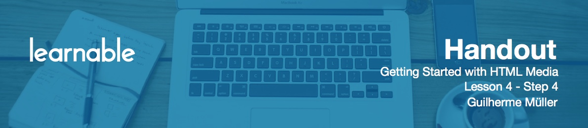

# Introduction

In this step, we're going to continue coding our media player. We've completed the initialization procedures and now we are ready to start assigning functions to each of the buttons. 

# Assigning Functions to Buttons and Sliders

First up is the play/pause button. We are going to use properties and methods of the media elements and events of the Media Events API. First, I'll set up a simple function that checks if the media is playing:

```js
function isPlaying() {
	return !media.paused;
}
```

Then, another auxiliary function to configure the correct button face for the play/pause button that uses the `isPlaying` function we just defined:

```js
function configPlayPauseButton() {
	if(isPlaying()) {
		//set classes to show the pause button
		playPause.classList.remove("face-play");
		playPause.classList.add("face-pause");
	} else {
		//set classes to show the play button
		playPause.classList.remove("face-pause");
		playPause.classList.add("face-play");
	}
}
```

We can remove and add classes to an element using the classList API. The `classList` property of an element has two methods that are of interest here: `remove()` and `add()`. So, if the media is playing, all we have to do is remove the `face-play` class, if it's present, and add the `face-pause` class. If the media is not playing, show the play button.

Now, we can assign the event listeners for the button and for other events. We're going to set up the click on the button, bu talso set event listeners that listens for other events. For example, if the user right-clicks the video and pauses it, I also want for the button icon to change.

```js
playPause.addEventListener("click", function() {
	if(!isPlaying()) {
		media.play();
	} else {
		media.pause();
	}

	configPlayPauseButton();
});
```

Test it in the browser. We finally have something working!

# User Right-click Fix

Let's add three more event listeners, this time to the media, not to the button. The three events in this case are play, playing, and paused. The `configPlayPauseButton` will be fired in all cases:

```js
media.addEventListener('play', function() {
	configPlayPauseButton();
});
media.addEventListener('playing', function() {
	configPlayPauseButton();
});
media.addEventListener('pause', function() {
	configPlayPauseButton();
});
```

Now when you right-click the video and click "play", the button changes.

# Programming the Seek Slider

Next, we have the seek slider. As we are using an input type range, we can listen for the change event to seek to the selected part of the media. To detect which part, we'll calculate the percentage of the area clicked and apply it to the media time like this:

```js
seek.addEventListener("change", function() {
	//determine the user-chosen time by discovering the percentage of the slider value multiplied by the duration of the media
	var selectedTime = media.duration * (this.value/100);

	//set the current time
	media.currentTime = selectedTime;
});
```

`this` in this case points to the range input.

However the handler is not following the elapsed time. For that, let's set up `timeupdate` events listener for the media:

```js
media.addEventListener("timeupdate", function() {
	//get the percentage of the video elapsed
	var percentageElapsed = (media.currentTime/media.duration)*100;

	//set the value to the seek slider
	seek.value = percentageElapsed;
});
```

Inside we calculate the percentage of the video elapsed, which is the current time compared to the overall duration times 100. After that we set the seek slider value. Now when the media is played the handle moves accordingly.

The final issue we have to address in this case is when I drag the slider: some stuttering happens. We can prevent that by pausing the video when the slider is clicked, resuming the playback when the slider is let go:

```js
seek.addEventListener("mousedown", function() {
	media.pause();
});

//resume the playback when the handle is set
seek.addEventListener("mouseup", function() {
	media.play();
});
```

# Programming the Mute Button

The next control we have to program is the mute button. When we click it, the media should be muted or, if its muted, return to the volume we had chosen earlier. That's why we set up earlier a `currentVolume` variable: to store the choice of the user. Besides that, when the volume is changed using the slider, we want the mute button to reflect the current volume using the three button faces we have configured using CSS.

Start by creating a function that configures the button like we did with the play/pause button. Since we have three icon classes here, we will have three situations in which to change the class on the element. So it's easier to remove all button faces before anything is done and then we just add the class that is needed like this:

```js
function configMuteButton() {
	mute.classList.remove("face-vol-mute");
	mute.classList.remove("face-vol-mid");
	mute.classList.remove("face-vol-full");
	if(currentVolume <= 0 || media.muted) {
		mute.classList.add("face-vol-mute");
	} else if(currentVolume > 0 && currentVolume < 0.6) {
		mute.classList.add("face-vol-mid");
	} else {
		mute.classList.add("face-vol-full");
	}
}
```

So if the volume is 0 or the media is muted, show the muted face of the button. If the volume is between 0 and 60%, we are going to show the middle range volume icon.

Now set up the click of the mute button:

```js
mute.addEventListener("click", function() {
	//here we'll check the "muted" property of the media
	if(media.muted) {
		//unmute the media
		media.muted = false;

		//set the value of the volume slider to the stored currentVolume
		volume.value = currentVolume;
	} else {
		//store the current volume for later
		currentVolume = volume.value;

		//mute the media
		media.muted = true;

		//set volume slider to 0
		volume.value = 0;
	}

	configMuteButton();
});
```

Inside it, we'll test the muted property of the media. If the media is muted, we want to unmute it; the volume when unmuting must be what the user was using before. If it's not muted, first store the current volume in our variable and then mute the media. Finally, we run the config function so it will evaluate the correct icon to show.

# Programming the Volume Slider

Next, we have the volume slider and this one is a bit simpler. When the slider changes, we change the volume of the media and assign its value to the `currentVolume` variable we created. We only have to divide the slider value by 100, because the `media.volume` property only accepts values from 0 to 1 (0 being mute and 1 being full volume).

```js
volume.addEventListener("change", function() {
	currentVolume = media.volume = this.value/100;
	configMuteButton();
});
```

Then set an event listener for the volume change event, so that this event also updates the mute button:

```js
media.addEventListener('volumechange', function() {
	configMuteButton();
});
```

# Programming the Fullscreen Button

The fullscreen button can be one of the trickiest. We are going to use the fullscreen API here, which is rather recent and is still subject to change. Also support is a bit lacking in some browsers.

First, we must create a function to test if the media is in fullscreen. For that, we'll have to test a property called `document.fullscreenElement`. However, as this technology is still being implemented, each browser uses its own version. This is how the function looks like:

```js
function isFullScreen() {
	if(mediaType == 'audio') {
		return false;
	}

	return !!(document.fullScreen || document.webkitIsFullScreen || document.mozFullScreen || document.msFullscreenElement || document.fullscreenElement);
}
```

Here the double "not" operator ensures that the return value comes only as `true` or `false`.

We also need a function to configure the fullscreen button like we did with the other buttons

```js
function configFullScreenButton() {
	if(!isFullScreen()) {
		//set classes to show the expand button
		fullscreen.classList.remove("face-restore");
		fullscreen.classList.add("face-expand");

		//remove the in-fullscreen class
		mediaPlayer.classList.remove('in-fullscreen');
	} else {
		//set classes to show the restore button
		fullscreen.classList.remove("face-expand");
		fullscreen.classList.add("face-restore");

		//add a class to the media player so the CSS knows that the media is in fullscreen
		mediaPlayer.classList.add('in-fullscreen');
	}
}
```

Now we need a function to actually set the media to fullscreen. This will also have some compatibility issues we need to address:

```js
function setFullScreen() {
	if(mediaType == 'audio') {
		return false;
	}

	if(!isFullScreen()) {
		if (mediaPlayer.requestFullscreen) {
			mediaPlayer.requestFullscreen();
		} else if (mediaPlayer.mozRequestFullScreen) {
			mediaPlayer.mozRequestFullScreen(); // Firefox
		} else if (mediaPlayer.webkitRequestFullscreen) {
			media.webkitRequestFullscreen(); // Chrome and Safari
		} else if(mediaPlayer.msRequestFullscreen) {
			mediaPlayer.msRequestFullscreen();
		}
	} else {
		if(document.exitFullscreen) {
			document.exitFullscreen();
		} else if(document.webkitCancelFullScreen) {
			document.webkitCancelFullScreen();
		} else if(document.mozCancelFullScreen) {
			document.mozCancelFullScreen();
		} else if(document.msExitFullscreen) {
			document.msExitFullscreen();
		}
	}

	configFullScreenButton();
}
```

Now set event listener for the fullscreen button:

```js
fullscreen.addEventListener("click", function() {
	setFullScreen();
});
```

and event listeners to change fullscreen button's state for each browser:

```js
document.addEventListener('fullscreenchange', function(e) {
   configFullScreenButton();
});
document.addEventListener('webkitfullscreenchange', function() {
   configFullScreenButton();
});
document.addEventListener('mozfullscreenchange', function() {
   configFullScreenButton();
});
document.addEventListener('MSFullscreenChange', function() {
   configFullScreenButton();
});
```

Check that in your browser!