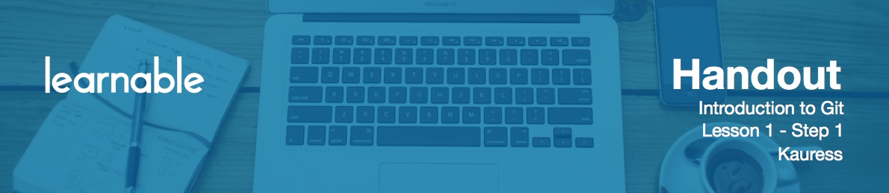

# Introduction

Hi, and welcome to this beginner's course on version control using Git!

# Course Road Map

This course is divided into 11 lessons.

* In the first three lessons we'll go over what version control means, what Git does, and some basic Git theory.
* From lessons four to eight, we'll do a project using Git commands. These lessons form a chunk of the course, and I recommend that you do the project along with me - this will help you to not only understand Git, but also to put it into practice.
* In lesson number nine and ten we'll put up a project on a GitHub page for potential employers and customers to view. We'll also play around with a few cool features on GitHub itself.
* We'll conclude our course at lesson number eleven which is just a recap of what we learned in the course.

I'd like to stress that in order to get the most out of this course, you should do the project which will allow you to understand and practice Git commands. And now let's go ahead and start learning about Git!