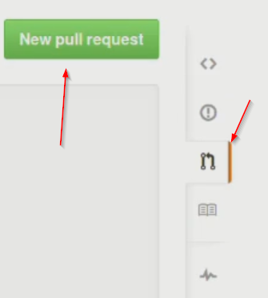

# Introduction

In this last section of our Git course, we will learn about `git pull`. We previously forked the repo and talked about how forking allows you to make a copy of someone else's repo in your GitHub account. Eventually, you can make modifications to your copy of the forked repo and contribute to the project.

# Git pull requests.

If you were to contribute to a project, how would you request the developers of the project to pull your changes into the original repo? This is where **pull requests** come into use. Whenever someone issues a pull request on GitHub, they're asking to review the code changes, and merge them into the original project.

Imagine someone had forked our team project, and they worked a bit on it, eventually improving the `featureA` branch. Now, there would be no way of knowing what improvements had been made to the `featureA` branch unless that person emailed you or somehow let you know that they had made improvements on line number 50, for example, of the *index.html* file. This is where the pull request feature on GitHub comes into use. Whenever a pull request occurs, the original repo owner will be notified of that pull request. Then the owner of the repo can look at the code changes, review them and decide to accept the pull request, therefore merging the changes into the original project or decline the pull request so that the suggested changes aren't part of the project.

To make a pull request, navigate to the Pull requests section of the repo's page and click on the "New pull request" button. Pull Requests can be of different types, and these types are organized by labels, for example, bug, duplicate, enhancement and so on.

You can also create milestones for your pull requests which correspond to pull requests collections for a certain project.