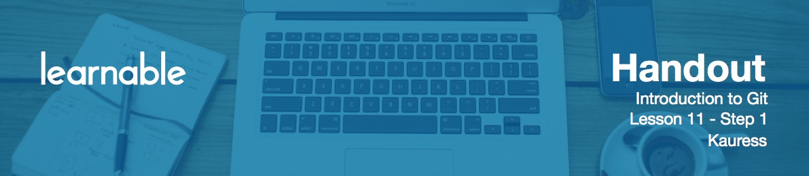

# Conclusion

Congratulations on completing the course. I hope you enjoyed doing the project and have enough confidence now to start implementing Git in your own projects. I hope you enjoyed the course and thank you for staying with me!