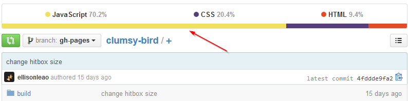

# Introduction

In this lesson we'll explore GitHub and discover trending repositories (**repos** as they're called for short), sign up for a GitHub account and make our very own repo. To finish off the lesson, we'll install and configure Git on the computer.

# Discovering New Repositories

Visit [github.com](http://github.com) and click on Explore. This will take you to a page with repos organized by categories.

A repository, or a repo, is a place where all your commit objects are contained. For now, just think of it as a place where all your code files and code sub-folders are contained.

Click See All at the bottom to see categories of popular code repos on GitHub; choose any category to browse repos inside. Next to the repo's name you will see the **primary language** used in that repo. The **star** denotes how many times this repo has been favorited (this is similar to liking a Facebook page or favoriting a Tweet).

Next to the star there is an icon here that means "**fork**". It tells you how many people have copied the repo to look at the code or just to play around with it.

Open any repo for now. Inside you will see all the code files and subfolders for the project. It's generally recommended that every repo have a **readme**. This provides an introduction to your coding project.

Clicking on the colored bar above the project's files reveals language statistics for the repo.

Clicking on this bar again will show you the number of commits, branches, releases, and contributors for the repo. If you don't understand what commits and branches means right now, don't worry, because we'll come down to it in lesson three.

Click on Contributors. This will reveal what GitHub users have contributed to the project. You can also view project's evolution or history. For example, it'll show you number of commits made during a certain week, code frequency and so on.

Return to the Explore page again. Clicking on Trending will show you currently trending repos. You can also find trending repos by developers by clicking on Developers.