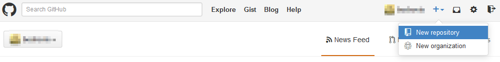

# Introduction

In this section we'll sign up for a GitHub account and make our very first repo.Now, it won't take very long, so I suggest that you do it with me.First, go to GitHub's homepage, which is github.com.

# Signup for GitHub

Navigate to [github.com](http://github.com). In the upper right corner fill in the sign up form. You will be taken to a page with member plans. The fee plan is already chosen by default so there's not much to do here. Click on Finish Sign up.

# Making First Repo

Let's create our first repo now. I previously mentioned that a repository contains all your commit objects. So for now, just think of it as a folder which contains all your code files and your code sub-folders.

To create a new repository click on the "plus" icon at the top and choose "New repository".

Now you can fill in all your repository details: name, description and so on.

Your repository will be public, that means anyone can see the repo. In case you wish to have private repos, you have to upgrade from a free plan to a paid plan.

Don't initialize the repo with a readme because we'll be sending code over from the PC to our GitHub repo.

Click on Create Repository. And there you go, you've created your first repo!

On the right-hand side are your repo settings and features so you can create a wiki for the repo, see a pulse and graphs for the repo. By clicking Settings on the right menu, you'll open a page where you can transfer the repo to another GitHub user, or delete the repo completely.

To check out your user profile, click on your user name in the upper right-hand corner of the page. You will see your user profile page and a contributions graph. The way the contribution graphs works is, the higher the commit frequency is (the more you interact with your GitHub repo) the darker the colored squares on the graph will be.

Your user profile also shows the number of followers that you have, your starred repos and people that you're following.

By clicking on Public Activity you will see what you've been doing lately.