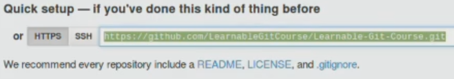

# Introduction

We're going to initialize Git in our *theme* folder and start using Git commands. We'll first initialize Git in our theme folder, then sync our remote repo to our local repo, and lastly we'll send over the contents of our theme folder to GitHub.

# Add, Commit & Push to Git

In your terminal type

```
cd Desktop
```

This stands for "change directory to desktop", so now we can navigate our desktop through our terminal.

```
ls -al
```

This stands for "list all" and will list all the files and folders on your desktop.

```
cd theme
```

The next step is to initialize Git in our theme folder and for this we'll use our very first Git command. Remember that even though you've downloaded and installed Git on your computer, you haven't yet initialized Git in the folder that you're going to be working in. To do that, type

```
git init
```

This initializes an empty Git repository in your *theme* folder.

To make sure Git is initialized type in

```
ls -al
```

You will see the *.git* directory among other files and folders.

Now we should also sync our remote repository to our local repo, and to do this navigate to your GitHub page where your repo is. Now, copy this link (make sure that the HTTPS button is selected):



In the terminal type in

```
git remote add origin URL
```

Replace URL with the link you've just copied. This means add the remote repository on GitHub, which is called origin. Origin is the name given to the remote repo by default. It's not a special name or anything, origin is just the name of address of your remote repo on GitHub.

To check if remote repo has been added type in

```
git remote -v
```

This shows you the URL of the remote repo to which you will be sending your file changes and fetching your file changes from.

Even though we've synced our remote repo by refreshing the GitHub page, you don't actually see any of our files and subfolders from within the *theme* folder.

Run

```
git status
```

It tells you the status of your present working directory: the files are not being tracked by Git. That is we haven't indicated that we would like changes in these files to be recorded.

So, go ahead and add these files to the staging area

```
git add .
```

Running

```
git status
```

again shows you that we're on the master branch, which is the main branch and we've added all these files to the staging area for Git to take a snapshot of.

In order for Git to take a snapshot we use another command

```
git commit -m "Initial commit"
```

`-m` stands for commit message. The commit command stores the current state of the files, and makes a record of them along with the commit message.

You will see the commit reference number, along with all the files that have been committed. Always provide commit messages - it is useful when you come back to review your work, or if you are working in a team with other people.

Type in 

```
git status
```

It tells you that there is nothing to commit, which makes sense, because after adding things to the staging area and committing them, we haven't added or committed anything new.

Now we have to send everything over to our remote repo. In Git terminology we have to **push** everything, send the taken snapshot over to our remote repo on GitHub.

```
git push origin master
```

`master` is the name of the main branch on our local repo.

Press `Enter` and put in your GitHub user name and password.

Now refresh the GitHub page - you should see all the files and subfolders from within the theme folder on your desktop here in your remote repo on GitHub.