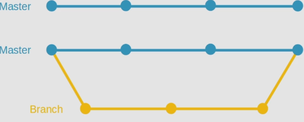

# Introduction

Until now all our work has been on one branch which is our main branch called `master`. Now suppose you decide to add a feature in your code project, and you make your changes to your files while still on the `master` branch like we've been doing until now. If you decided to remove the feature later on, you'd either have to change all your files to represent their previous stat ebefore you added the feature, or you'd have to go back to the last commit before you started adding your feature code on the `master` branch. Either way, both are a messy and time consuming solutions. You can avoid this with **branches**.

# Branches in Git

Think of a git branch in terms of its purpose which is to provide a separate environment where you can experiment, for example, add or delete features using the same `git add` and `git commit` process that we've been doing many times. By doing work on a git branch the code base on the `master` branch remains untouched. This is good because ideally you want to abstract any experiments away from the main code base.

When we create a new branch, it, by default, contains all the code which was on `master` - this is how we can continue experimenting and making changes in a separate environment. So when you make your new branch, it's essentially a copy of the `master`, until you start making your changes on that specific branch.

Related to branches is the concept of **HEAD**. HEAD is a pointer, which points to the most recent commit (snapshot) on the branch that you're currently working on.
