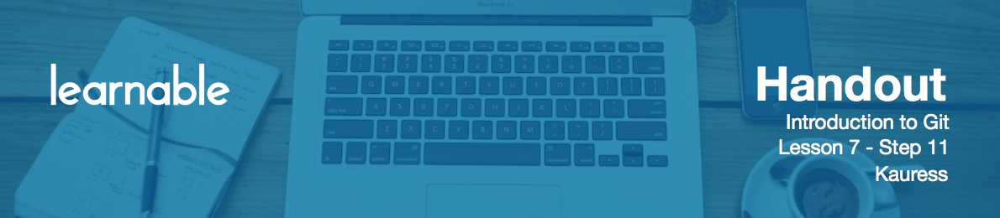

# Introduction

For our last merge we're going to be merging branch `featureA` into the main `master` branch.

# Merging Branch featureA into Master

Type

```
git checkout master
```

Let's merge branch `featureA` into `master` with

```
git merge featureA
```

It's asking us to type in a merge commit message. Type anything and exit the editor.

Do

```
git log --pretty=oneline
```

You will see a new merge commit right at the top.

Now push our work to the remote `master` with

```
git push origin master
```

Open GitHub repo to check that everything is okay.