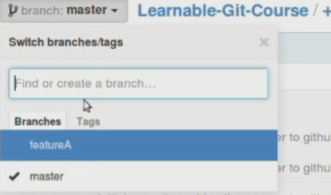

# Introduction

As I previously mentioned, branches provide you with an independent line for development so you can experiment and do different things without touching your code base on the main `master` branch. At this and the next steps we are going to work with different branches and push our changes to GitHub.

# Pushing to Branch featureA

Type in

```
git branch -a
```

We're on the `master` branch, so let's check out to the `featureA` branch with

```
git checkout featureA
```

Now let's edit our *index.html* file. Scroll down to the `h2.intro-text.text-center` element and replace it with

```html
<h2 class="intro-text text-center">Feature A Branch<strong>Our first branch!</strong></h2>
```

Now let's add, commit, and push the work for our `featureA` branch to our remote repo on GitHub. Unless you push your branch to GitHub it won't be visible to your other teammates. So in your terminal, type

```
git add .
```

I'm using `.` instead of the file name, because I want to send the entire contents of the `featureA` branch over to a remote repo on GitHub. And as you remember, by default it contains all the contents which was on `master`.

The next step is to commit

```
git commit -m "Initial commit on feature A"
```

Push our work to GitHub with

```
git push origin featureA
```

Check out your GitHub repo - a new branch should be present there.

