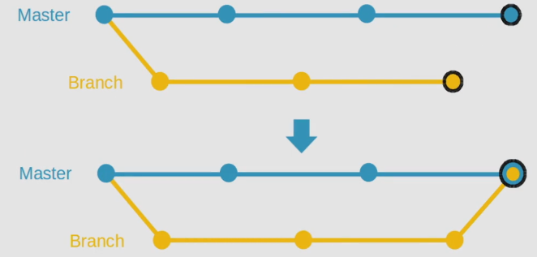

# Introduction

Now that we've done some work on our branches, let's discuss **merges**.

# What is Git Merge?

`git merge` command merges a branch into your current branch (the branch that you're currently checked out on).

For example, if you're working on a new login feature on the `featureA` branch, we can make the login feature a part of the code base on our `master` branch by first checking out into `master`, and then using

```
git merge featureA
```

A merge commit will be created.



In this diagram you can see the yellow feature branch merging into master. The black circle denotes merge commit.

There are different types of merges:

* **Fast-forward merge**. If there has been no development on the `master` branch (no commits on the master branch ever since we made our feature branch), then when we merge our feature branch into the master branch, HEAD will point to the latest commit on the feature branch. This makes sense because, if you remember, when we make a branch it contains the codebase which is on the `master` branch by default. So assuming the master branch has had no changes after we made our feature branch, then the feature branch is just an extension of our main `master` branch.
* **No fast-forward merge**. When a "no fast forward" argument is passed to a `git merge` command, assuming no development has taken place on the `master` branch, then instead of pointing to the latest commit on the feature branch like previously, a separate commit is issued to represent the merge.
* **Three way merge**. With this type, three commits to generate the merge will be created. Two commits come from the tips of your branches, and the third commit is taken from a common ancestor. Three way merges occur when development has taken place on branches simultaneously.

You don't have to indicate specifically what type of merge method you want to use, as this is determined by an algorithm. An exception to this is with the no fast forward merge.