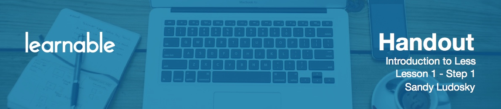

# Introduction

Hello and welcome to Introductions to Less course. My name is Sandy. I'm a front end developer based out of Toronto in Canada. In this tutorial I will teach you how to take your CSS to the next level and how to speed up your web development process using **Less**.

# Why Less?

Less is a CSS **pre-processor** language that allows you to extend your CSS by writing less code, which is re-usable, better organized and easier to manage. Less comes with great features: variables, mixins, nesting, mathematical calculations with the operators, imports directive, built-in functions, namespacing and string interpolation.

# What we'll build

This tutorial includes two hands-on projects. To build them we will have to convert the Less syntax into standard CSS using a Less pre-compiler. And so, as part of this tutorial I will make introductions to the Koala application which is a Less precompiler.

So thank you for joining and let's get started!