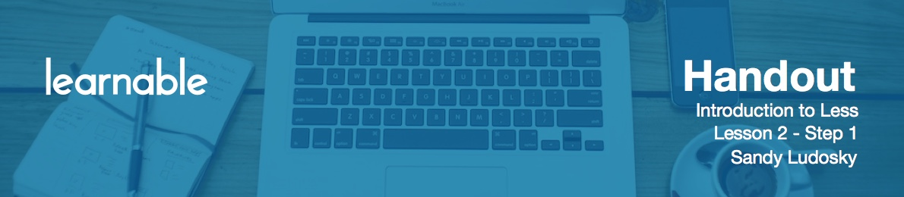

# Introduction

In this part of the course, you will learn how to take your CSS to the next level with the power of Less, and why you should use Less over CSS.

# What is Less?

**Less** is a **pre-processor language**, a superset of CSS, that extends the standard CSS syntax. Less is also called dynamic stylesheet language, because it arranges CSS with many common features that you find available in the most modern dynamic programming languages. So Less looks like just CSS, except that it includes extra advanced features. For example:

* **Variables** for faster maintenance like in other programming languages like JavaScript: you can define a variable, assign it a value and reuse it multiple times in your stylesheet.
* **Nesting** for a cleaner structure of the stylesheet.
* **Mixins** as well - using them you can declare a rule set as reusable objects in one place. That allows you to write object-oriented CSS.
* **Operators** that allow you to do math directly in your stylesheet.
 
Less allows you to cut down on code by writing reusable and less code. Your styling is better organized and easy to maintain as a result.