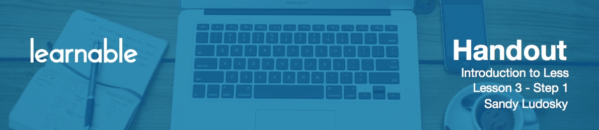
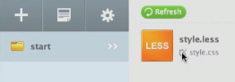
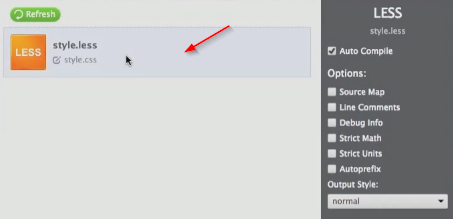

# Introduction

In this step I will show you how to download and install the Koala application - a Less compiler that we're going to be using to compile the Less code into standard CSS.

# Download Koala

Navigate to [koala-app.com](http://koala-app.com/) and click on the big download button. You can choose either version for Windows or Mac. After installation finishes, you can proceed.

# Koala Installation

Download course materials to the location which is convenient for you (either the Documents folder or the Desktop, for example).

You may grab a folder or a file and drag it into the compiler.

By clicking this icon you can choose the location where you want to save the output in CSS.

You can click on this row in order to expand the sidebar on the right. There is a list with different options:

* **Auto compile** is checked by default. This is going to allow it to compile the less code into standard CSS every time you save your file.
* **Output styles**. There is normal and compress.