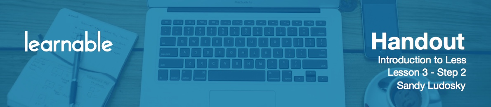

# Getting Started

Now we are ready to get started and to work with the less features. In order for you to follow me you're going to need the course materials so download them if you haven't do it already. Inside you're going to find two folders, that corresponds to the two projects. Each of the folders is organized with separate folders that corresponds to specific video lesson. Each of them includes an end and start folder. This will allow you to follow the class and to complete the demonstrations from one specific section of the course.

I will start by opening the entire folder for the lesson 2.2 in the Sublime Text editor. Inside Sublime Text I'm using two panels. You can obtain this layout by going to View > Layout > Column Two. That's really better for the demonstration because that's going to allow you to work with two files at the same time.

# Variables: How it works!

To define a variable you will always start with the symbol `@` followed by a name. Then you're going to assign a value, which can be a hex code value or color's name. You must always finish with a semicolon:

```less
@dark: black;
```

Once you have defined your variable, you can then use it multiple times wherever you want in your Less code:

```less
h1 {color: @dark;}
```

So we use this variable for the property `color`. We must always finish with a semicolon - then the Less compiler will take care of converting into standard CSS that can be read by the browser.

Variables may take different values: colors' names, hex code values, numeric values and lists. 

```less
@border: 4px solid @dark;
```

Here `@border` has three different values for the width, style and the color. For the color we are using another variable.

Let me show you the structure of the *index.html* file that we're going to be using to work with the Less features. There are the following sections: the header, the navigation, the main section and the footer.

Now open up the Koala application. You can drag the folder that you're going to need for your project and drop it directly on the interface. Koala application will automatically recognize which file is the Less file and generate *style.css*.

Apply a background color to the `header`:

```less
header {
	background: @darkgrey;
}
```

We're using a variable `@darkgrey` that we have defined at the top of the file.

Now we have to make sure that the *style.css* is included into *index.html*:

```html
<link rel="stylesheet" type="text/css" href="style.css">
```

Now style `h1`:

```less
h1 {
	color: @lightgrey;
	padding: @padding;
	margin: 0;
}
```

Check it out - you will see that this has been converted into standard CSS.

On to navigation. There are three links at the bottom and we're going to use a lighter shade of grey:

```less
nav {
  background: @mediumgrey; 
}

nav ul {
	margin: 0;
}

nav ul li {
	display: inline-block;
	font-size: @fontSize;
	margin: @margin;
}

nav ul li a {
	text-decoration: none;
	color: @lightgrey;
}
```

# Compress Less file

There is one last thing I'd like to show you before we complete this lesson.

In the right-side pane of the Koala app there is a dropdown for the output style, either normal or compressed. Select compressed and you're going to see what it does. Now save the file with your less file.

Open *style.css* and you will note that the output is compressed. This is not really readable, so it's not something that you would be using in the development mode. However when your site is ready to go live in production mode this is a good idea to use compressed styles which will reduce the size of the file dramatically and improve the performance of the site as a result.

For this demonstration, however, return to normal output mode.