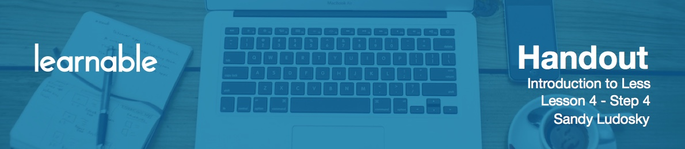

# Introduction

So now we're going to style the "Our Services" section.

# Styling Service section

So, we're going to add some LESS code in order to format this section of the page.And, we're going to be using the file mixins.less, inside of which,I have declared a group of code, inside the namespace commonRules.And, we're going to be using this namespace commonRules fordifferent sections of the page, with kind of a similar format for all of them.Except for a few differences.That is pretty straight forward.So for example on the left you have a first div with a class top.Then you have another div with a class grid.And in the LESS code on the right you can find the corresponding class, mixins.With which you are targeting so, different elements.So the h2 or the p element.Then with the class grid we are targeting so the div, the h3, andthe h4 and also the images.So that section work, for the services, doesn't include any images.But we could use these namespace commonRules for any of the sections thatincludes images and then the corresponding CSS properties will apply.Now that we've had an overview of the section that we want to design andof the namespace, the different mixins that we want to use for that design,we're going to go to the LESS code.We're going to copy the namespace first, and we're going to add this one tothe selector that corresponds to the section with the ID work.So now we're going to check the output in CSS.And we're going to see all the styling for the services section.So all the CSS properties andselectors have been generated as a result of the common rules.Which is now targeting the elements of the work section.So we're going to reverse back just to show you.So by removing the common rules, you can see that now we have no styling forthe Services section.This is completely empty.And then we're going to go back again then put it back.And as a result so by using the commonRules that includes a group of code,we now have all the styling for the services section.So we've done much of the leg work by defining first this namespace thatincludes a group of code which is going to target different elements of a section.And that's going to allow to design entirely a section.And here it is, and now we have our section Our Services.So we have the h2 with a much bigger font size.Same for the p element below.Then we have the divs to showcase the different services,so Web Design and App Development.So, we're using a four column layout for the div.And all of that was designed, customized as a result of the namespace that includesa group of code targeting all the elements for the different sections.And next, I'm going to add a background color to this section.So, we're going to keep the commentRules namespace.And at the top, I'm going to place another property that's going tobe the background.And I'm going to be using the variable, @light, to apply a background color.And that's it, we're going to refresh and here it is.So that was a good demonstration that with LESS you can do a lot of thingsby writing LESS codes.You can then define mixins variables that you can reuse multiple times, same forthe namespace.And the great thing is that you can use them multiple times as many times as youwant in your style sheet.So, this is what we're going to do next.