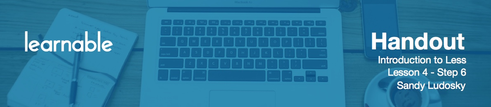

# Getting Started

Now, it's time to customize the bottom section of the page. It includes the About, Contact and Location sections. We're going to be using similar CSS properties that we've been using for the previous sections and employ a multi-column layout.

First of all, go ahead and add the same namespace like this:

```less
#bottom {
	#commonRules;
}
```

That is a starting point for us.

```less
#bottom {
 #commonRules;
 text-align: left;
 background:@asbestos;
 color: @light;
}
```

# Styling About, Contact & Location section

Now let's format the layout.

```less
#bottom {
 #commonRules;
 text-align: left;
 background:@asbestos;
 color: @light;

	#about {
	.column(6);

		div {
	 	.row(6);
	 	padding-left: 0;

	 		p {
	 			.column(3,6);
	 			margin: @margin;
	 			font-style: italic;		 
	 		}
	 	}

		.inline {
			#inline_list;
		}
	
	}

	#contact {
	.column(4);

		ul  {
			padding-left:0;

			li {
			 .list;
			}
		}

		 .inline {
			#inline_list;
		}
	} 
	
	#locations {
	.column(6);

		.inline {
			#inline_list;
		}
	 
	}
  .clearfix();
}
```

So basically we are adding the column layout and employing `inline_list` namespace.