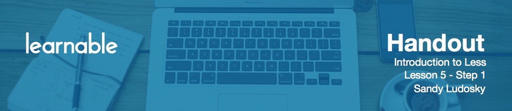

# Conclusion

I really appreciate you taking the class. I hope that you enjoyed it, and that you could get a lot out of Introduction to Less. These lessons were a good overview of how you can extend you CSS with the Less features. You can now use it in your work in order to be more productive, and please feel free to ask questions - I will be glad to assist you through your learning progress.

Goodbye for now and keep on coding and writing less code!