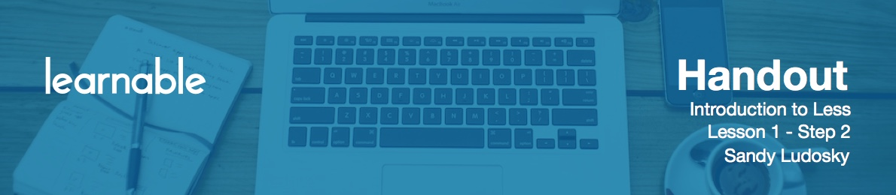

# What we'll learn

Let's discuss what we are going to learn in this course.

In part one you will discover the power of less with examples and demonstration. I'm going to start with an introductions to understand what is Less, and then we are going to look at the Less syntax. I'm going to make a demonstration with the Less online compiler, WinLess. Then we will talk about the Less usage and see how to get started with Less, and how to integrate it in your project.

In part two, where you will learn to write better CSS with Less, I'm going to make an introductions to the application Koala. So Koala, which is a graphical user interface for Less, to learn to compile your Less stylesheets into standard CSS. Then it's going to be time for your first, hands-on project.

In part three you're going to have the final project to apply what you've learned. That's going to be the opportunity for you as well to advance your learning by discovering more advanced Less features. 

By the end of the course, you will know how to write better and more maintainable CSS.

# Requirements & Objectives

For an optimized learning experience, it is preferred for this class to have some basic coding skills. At least basic knowledge of HTML, CSS, and JavaScript is required. This class has been especially designed for beginners and anyone who is willing to make their first steps with a pre-processor language.

For the tools, you're going to need a code editor. I'm going to be using Sublime Text, but you are free to utilize any code editor of your liking. Of course, an absolute requirement is for you to have a Less pre-compiler. We're going to be using Koala which is a graphical user interface for Less. I'm going to make an introduction later during this class, and walk you through the download and installation process.

I would recommend you to use a modern browser like Chrome (Firefox is fine as well). We're going to need also to use Winless which is an online Less compiler for our first demonstration with the Less features.

The course files are available for download in order for you to follow along with me during this tutorial. And once you're all set, we can then get proceed to the next lesson!