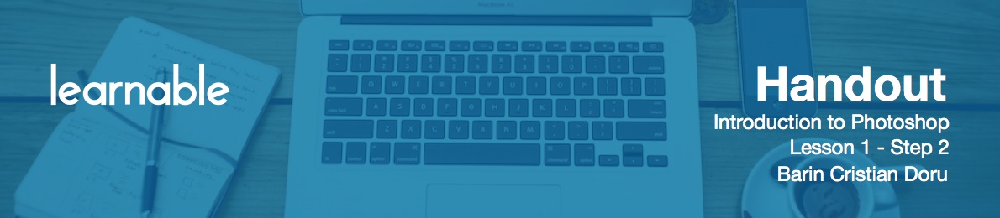
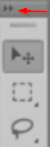
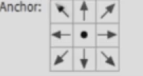
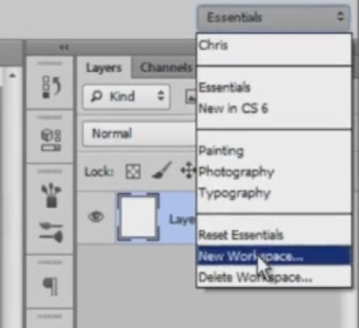

Let's open up Photoshop.

# Getting started with Photoshop CS6

I'm using Photoshop CS6 on a Windows 7 platform. In case you have a previous version of Photoshop, or you're using Mac, don't worry, since everything is mostly the same. Go to File > New and select Web from the Preset dropdown.

* Notice the resolution is 72 Pixels per Inch, which is the web standard.
* The color mode selected is RGB.
* The width and height are the only settings you may need to adjust.

The other options do not interest us at this point. So, just hit OK.

# Your work area

You will see your work area - get accustomed to it a bit. The tools sit on the left side, and you have a bunch of panels on the right side. The white area that appeared in the middle is called the **canvas**. In the next step we are going  to customize the workspace.

# An overview of tools and tabs

In the top-right, we have the **Colors and Swatches** panel. Click the little icon in the top-right, and hit "Close Tab Group". Do the same for **Adjustments and Styles** panel.

On the left, tools occupy two columns. You can just hit this icon

and it will switch between states.

Now let's open up some panels. Go to Window, and select Character. We will use this for text editing. 

Then go to Window, and select Brush. That's going to add a small side menu. The first icon here is the History panel. Press it, and drag the panel to expand it. Think of it as of time machine. If you make a mistake, like delete a layer by accident, just open up this panel, and go back in time.

Now press `Ctrl+R`, and rulers will appear. After that, go to View > Show > Smart Guides. These are great, because they help to position objects precisely.

In case you want to resize your canvas, go to Image, and select Canvas Size. Use the arrows to decide from which part of the canvas Photoshop, should add or delete pixels. Leave it as is, and Photoshop will add or subtract, from each side.

CS6 has by default a darker scheme. If you want a lighter one, go Edit > Preferences > Interface, and choose the one you like.

The layers on the right panels should have Small Thumbnails. Right-click on the left side of them, to choose the size.

Now let's save the workspace. Go to the top-right, and press New Workspace.

Enter a name and click Save.

This project is empty but still, let's see how we would save it. First we'll go to File, then Save As. Here we'll choose a File name and the Format (choose *.psd*). After you've saved once, constantly hit `Ctrl+S` to save again.

In case you want to save your creation in order to share it with everybody, go to Save for Web. What interest you here, is the File format, the Quality, and make sure you have Convert to sRGB option unchecked.