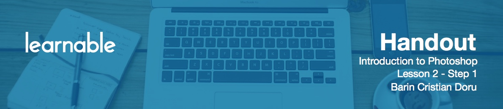
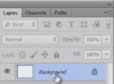
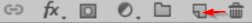
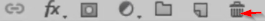
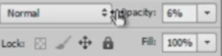
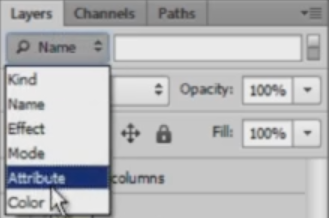

# Introduction to layers panel

The **Layers** panel is located on the right side of the screen, and can be turned on or off by pressing `F7`. There you will find layers and folders. When you first create a new document, you will see only one layer named **Background**. This is the white background on the canvas, and it's always locked.

# Working with layers

To make background editable, just double-click it and hit OK. Now you can use this layer, for example, to draw something.

At the bottom of the panel, you have a couple of buttons, one of them being Create new layer. Press that and you'll have a new layer.

If you draw on it, but then decide you don't like it, delete it by hitting the `Delete` key or just dragging the layer to the dumpster.

You can think of layers like of transparent pieces of paper that stack on top of each other.

# Understanding the concept of layers

You draw a house on one layer and a car on another. Maybe a tree on the next and so forth. The end result looks like only one image, but it's actually the stacking that makes it look that way. If I don't like what I'm doing with the house, I can erase and adjust, but objects from the other layers aren't going to be affected. This is the whole concept of layers: **nondestructive editing**.

This allows you to achieve a lot of things this way. The eye to the left of the layer indicates its visibility. If you press it, you make it invisible; press it again to make it visible. Scroll up and down for a mass action, or hold `Alt` while clicking on an eye to make only that layer visible.

# Organizing layers into folders

**Folders** act the same way as in your operating system: they organize things. Press this button at the bottom to create a folder.

Then you can drag the layers inside it. Or select a couple of layers by using `Ctrl` and then hit `Ctrl+G` to group them. Be sure to always group files that belong together. Furthermore, you can rename any layer or folder by double-clicking on its name to easily find them later.

# Introduction to layer styles panel

Now let's talk about the **Layer Styles** panel. We'll use this quite a lot, so press `U`, draw a rectangle, and then add layer style to it.

With this, we can create a lot of web elements like menus, buttons, backgrounds and more. For now add  a stroke and focus on the top of the panel. Here you have **Opacity** and **Fill**.

Lower the opacity and the entire square fades in visibility. Lower the fill and the layer effect, in this case the stroke, remains the same. That's the difference between Opacity and Fill.

# Searching and locking layers

In CS6 you have dropdown menu at the top through which you can search for a layer.

You can look for it by name, by color, by effect and so on.

Last thing that interests you about this panel, is the possibility to lock a layer. Say you don't want to move a layer by accident. To do that just click the lock icon next to the layer.