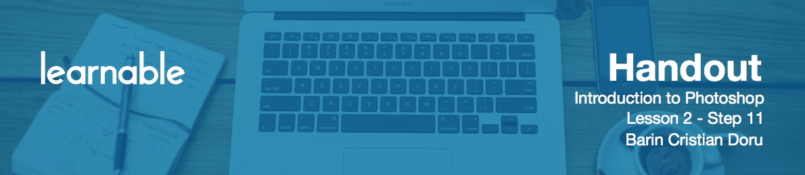

# Introduction to vector shapes panel

Use the `U` key to create **vector shapes** that can be made larger or smaller without losing quality. These have a large role in web design. For example, you can use the rectangle tool to mock up the layout of a web page.

# Using rectangle tool and options

Draw multiple objects that represent the logo, main menu, slideshow, content area, and so on.

The color of the shape is dictated by your foreground color.

After you've placed it on the canvas, double-click on its thumbnail in the Layers panel to change its color. You can use `Ctrl+T` to resize it as you want. Plus, you can modify it even further by right clicking and selecting one of the presented options, like Skew, Perspective, Distort, and others.

At the top panel you have a couple of options. You can manually input width and height by entering a value in pixels in the W and H boxes. To the right, there is a dropdown that controls the way a shape is added to a canvas. It can be placed into a new layer, it can combine with an existing shape and more.

# Using rounded rectangle tool and options

The **Rounded rectangle tool** has the only difference - it allows to set the radius (look for the corresponding field on the top). Usually four to five pixels means a pretty subtle rounded corner, whilst anything over 10 means quite rounded.

# Using line tool and options

The **Line tool** will come useful in a lot of situations. Make sure it's solid, with no stroke, and always see that the weight is set at one pixel. If you want bigger lines you can always use `Ctrl+T` or just use the Rectangle tool. 

# Using custom shapes and options

Custom shapes are great since they are vector shapes as well, so you can make them as big as needed and they will still look good. There are a lot of free custom shapes on the Internet that you can download for free. Make sure you have a nice collection so you can use them in your projects.