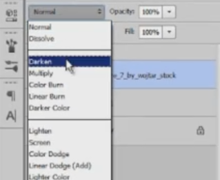

# Blending modes

As you now know, layers stack on top of each other. You can achieve various effects by changing the way they interact with **blending modes**. I suggest you get two layers, place them on the canvas in the approximate same position and scroll through the blending modes.

Depending on the colors in the layer, your results will vary. Play with the opacity and you'll get even more out of this powerful tool. Note that if you have a certain layer effect activated, blending modes won't work.