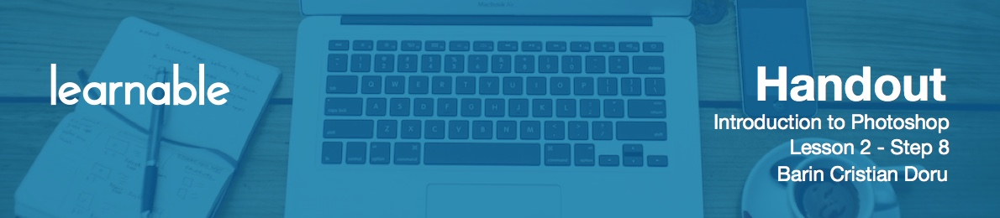
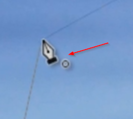

# Dodge, Burn and Sponge tools

We won't be using these tools a lot, but they might come in handy in some rare project.

**Dodge tool** is used to lighten an area.

**Burn** is the opposite of Dodge, it makes things darker.

With the **Sponge tool**, you can either saturate or desaturate colors. Change the way it works by using the Mode option up top. For example, if you check **Vibrance**, the tool will act more gently. This is nice when you want certain areas to pop more.

# Pen tool

The **Pen tool** is another major component of Photoshop, next to the Brushes and Selections. It has an infinite potential and that can be very scary for inexperienced users. This tool can be used to create more complex shapes, to make very detailed selections and much more.

Having said that, our web design projects don't necessarily need those skills. Still I recommend you hit `P` to select Pen and play around to see what it can do. Set a point, then click and drag to make what is called a Bezier curve and now look to close the shape. You'll notice your cursor will change when you're about to close it off.

If you right-click, you'll get the same menu as for any selection.