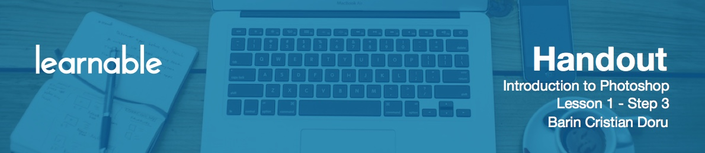

# Setting up Photoshop

To set up Photoshop for best performance, you need to go to Edit > Preferences > Performance. For the Memory Usage, Let Photoshop Use up to 95% of your RAM. When the program uses all of it, it then resorts to using your free space on your drive. The more you have, the better. Photoshop calls this drive a **Scratch Disk**. In case you have a separate partition for your operating system, don't use that as a Scratch Disk, since I've seen crashes more often.

In the History States, don't enter value more than 10, if you have a slow computer. This refers of the number of times you can go back in time.

For the Cache Levels and Cache Tiles Size, just leave it at the default level for now.

In Units & Rulers, make sure you have your Units set to Pixels.

A very important option in Photoshop is in the File Handling, where you can set an Automatic Save. The program might crash from time to time, and if that happens, when you open it up, you'll have a recovered file. This is only available in CS6. So, if you’re running a previous version, you need to use `Ctrl+S` more often.