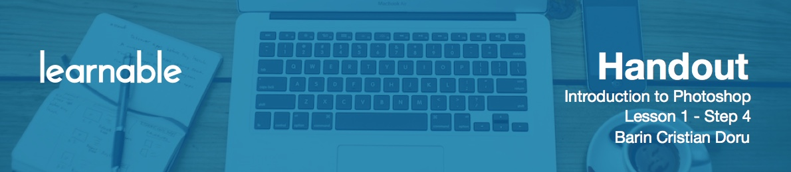

# Using hotkeys

You're going to use Photoshop a lot, so you'll need to be as efficient as possible. So, you'll be using hotkeys throughout the program. In the *resources* folder (found in the accompanying archive), there is an image named *shortcuts.jpg*. Open that up and keep it around as a constant reminder of them. You can also hover on top of the tools and see their names and shortcuts. Be sure to hold each tool down for a second or so to see if it has any others underneath. Or you can just use Shift and that tool's hotkey to scroll through.

# A run down of hot keys

Here is a quick rundown of what you will be using very often:

* `V` for the move tool.
* `F` two times for the full screen mode.
* `Ctrl+G` to group layers into a folder.
* `Ctrl+J` to duplicate a layer.
* Hold `Space` to move around the canvas.
* `Ctrl+Z` to undo
* `Ctrl+Alt+Z` to go back yet another step.
* `Ctrl+1` to zoom in at 100%
* `Ctrl+A` to select all.
* `Ctrl+D` to deselect.
* `Ctrl+T` to free transform.
* Hold `Ctrl` and click on the canvas to select the layer from the canvas.
* `Ctrl+Shift+click` to select multiple layers on the canvas.
* `Ctrl+G` to select a group on the canvas (instead of layer).
* `Ctrl+;` to show or hide guides.
* `Ctrl+'` to show or hide the grid.

# Reworking tabs

I know that seems like a lot, but you'll learn these hotkeys by working with them, not by memorizing. 

A couple of other things to keep in mind are the tabs on top. If you see an asterisk next to a close button, this means the progress is not yet saved. Use `Ctrl+S` to fix that. If you detach any tab, go to Window > Arrange > Consolidate All into Tabs. This way, it’s always nice and organized.