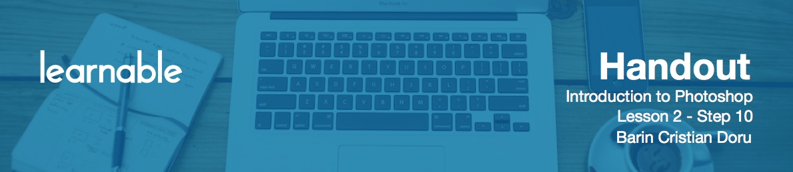
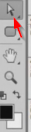

# Direct selection tool

The **Direct selection tool** is important when working with rounded rectangles, which basically translates into buttons manipulation.

Say you've made a very nice button with rounded corners, and you want to make it bigger. Free transform distorts the button's aspect. So what you need to do is hit `A` for the Direct selection tool. Make sure you're on the white arrow in the left pane, not the black one.

Now go inside the button and select the top edge, then hold `Shift` and select the bottom edge. Go to the line, hold `Shift` and drag to the side. Now your button is longer but it has the same corner radius. Hit `Enter` to finish up.