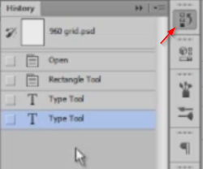

# Undo and history panel

Photoshop allows you to go back in time by using the **History panel**. You can activate it by going to Window > History or by clicking on the first icon in the right side menu.

Remember that `Ctrl+Z` is **Undo**, but if you press it again, that will be **Redo**. So in case you want to go back multiple steps, you'll need to use `Ctrl+Alt+Z`.

I recommend you work with ten history states if you have an older computer: the more states you have, the more resources Photoshop will need.