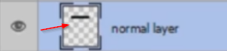
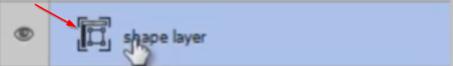
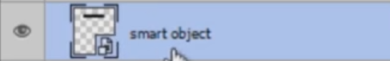

# Comparing pixel shapes and vector shapes

The concept of a **pixel shape** versus a **vector shape** is simple. The first one can't be enlarged without losing quality, while the latter can. For example, if you draw a rectangle and enlarge it, everything will scale, and you won't lose any quality. On the other hand, if you have an image with a normal set of pixels, enlarging it will produce a bad result.

Normal pixel layers have the following icon on the Layers panel:

while shape objects have this small thumbnail:

# Smart objects

You will also notice another icon in the Layers panel:

That means this image is a **smart object**. These layers protect your original image, so, for example, if you add a filter, it can later be turned off, and the image remains the same. Whereas with a normal layer, it can't be turned off.

Another example is with resizing. Suppose you have two layers with the same picture: one is a smart object, and the other is not. If you make them both tiny, and then resize to their original form, the normal image would become very fuzzy, while the smart object would not. That is because Photoshop stores those pixels in the smart object form.

# Converting layer to smart object

To convert a layer to a smart object, go to the Layer panel, right click on it, and hit Convert to Smart Object.

# Converting layer to normal layer

If you want to transform a smart object to a normal layer, hit Rasterize. Why would you want to do that? Well, if you have only smart objects, your project will demand more resources and have larger size.