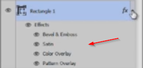

# Working with layer styles

We'll use **layer styles** in many scenarios. You can access them by clicking on this icon:

Mastering layer effects is crucial in web design because that allows you to produce great web elements like menu bars, call to action boxes, buttons, and basically every single element a website needs. At this point I suggest you set a background color, drag a shape and start adding layer styles to see how they work. After you're done hit OK button and you'll see you've chosen effects underneath the layers.

# Toogle visibility, copy and clear layers

You can toggle the visibility of each effect, or the entire set.

You can also right click and copy these layer styles so you can apply them to other objects.

You can also clear the layer styles by using the corresponding option from the dropdown menu (click right mouse button to access it).