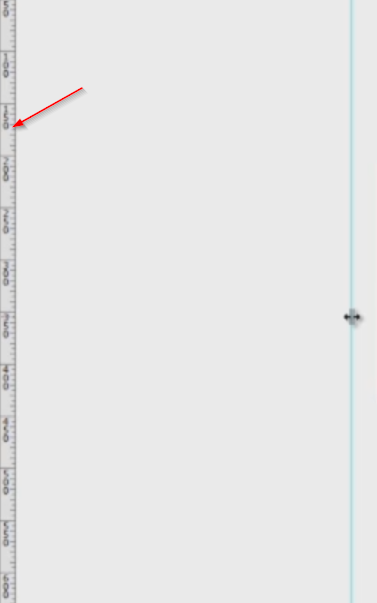
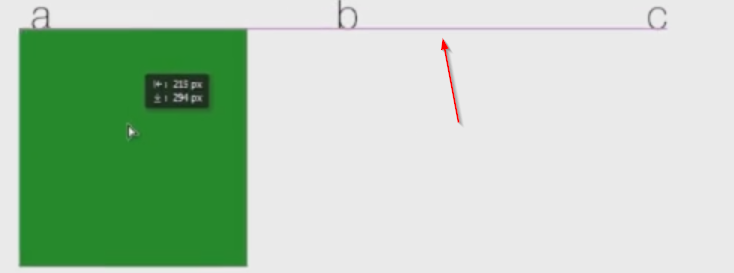
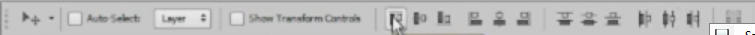

# Moving layers

You can move layers and folders in the layers panel by dragging them. In order to move a layer on the canvas, hit the `V` key (make sure that it is not locked). You can move it with your mouse, with your keyboard arrow keys or by holding `Shift` and pressing an arrow key to move it by ten pixels.

To select a layer from the canvas, and not from the layers panel, just hold `Ctrl` and left click it on the screen. Use `Ctrl + Shift` and click to select multiple layers. However always take a look at the layers panel to see what you're selecting.

Let me show you a neat trick. Say you're on the Brush tool, but you want to move the layer around. Instead of pressing `V`, you can hold `Ctrl`, and you'll temporarily have the Move tool selected instead of your current one. This way you don't have to constantly switch tools.

# Introduction to guides

In many cases we need to move objects with precision. To help us, Photoshop has a bunch of options and the first one is the **guides**. Click on one of the sides with a ruler and drag - you'll see a light blue line appear. That's a guide.

It can help you align things. To show or hide them, use `Ctrl + ;`. Notice that if you activate the Move tool and go over a guide, you can actually move it. That's great but, sometimes you want to lock guides. To do that, press `Ctrl + Alt + ;`.

# Introduction to grid

The **grid** is another option Photoshop has for you. Press `Ctrl + '`, and it will show up. Lining things up has never been easier.

# Introduction to smart guides

Now let's have a look at **smart guides**. Place multiple objects on the canvas and move one. You'll see some red lines appear indicating how you're object is placed in relation to others.

If they don't show up, go to View > Show > Smart Guides to enable them.

# Introduction to align tools

Last but not the least is the top panel. Select multiple objects and play with these options to see if they work.

Their names may sound complicated, but the icons really tell the story. These are amazing when you want to perfectly align or distribute items on the canvas.

# Introduction to auto select and show transform controls

And while we're at the top, let's take a look at the left side. I told you about the `Ctrl + click` technique used to select a layer or group from the canvas. But you could also check the Auto Select box and get almost the same thing.

With that option activated, wherever you click on the canvas, that layer or folder will be selected. Uncheck that for now, since it's not good for the workflow.

The Show Transform Controls is another box you need to leave unchecked because we use the `Ctrl+T` method to resize an object if we want that.