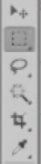

# Introduction to selection tools

**Selection tools** are used select an area of an image and further work on it. You have multiple tools that can perform selections, each one of them working in a slightly different way. Something to notice is that you can't free transform, delete, paint over, or work on your selection if your layer is a smart object (we will discuss this concept a bit later on). But at this point, you need to know that this applies for every selection tool.

# Working with marquee tool

The **marquee tool** is the first one in our side panel.

Hit `M` to select it. You can make rectangular or elliptical selections on your canvas. Get the rectangular one and drag across the screen. To deselect, hit `Ctrl+D`, or right click and hit Deselect.

* If you want a perfect square selection, hold `Shift` while dragging.
* Hold `Space` if you want to move it around.
* To add to a selection, just hold the `Shift` key and drag.
* To subtract, hold the `Alt` key while dragging.
* To make a selection from the middle, hold down `Alt+Shift` while dragging.

Same principles apply for the elliptical marquee tool.

# Selection options

After you've made a selection, you can right click on it and see multiple options, which are common for all selections no matter what tool you've used.

* **Deselect** might seems like a pretty useless tool, but keep in mind that sometimes you may forget to deselect and you won't be able to use other tools until you've finished with your selection. You may also use `Ctrl+D` which is much faster.
* **Inverse** is quite useful when you want to select an object from your image, but it's easier to select everything around it and then reverse the selection.
* **Feather** blurs the transition between the selection and the surrounding pixels. When you click it, a box will appear asking you what pixel radius you want selected. Enter something dramatic like 50 pixels, and then press `Ctrl+J`.
* **Save Selection** allows you to save a detailed selection that you don't want to lose. To bring it back, just go to Select > Load Selection and choose its name.
* **Layer Via Copy** and **Layer Via Cut** are widely used as well. The first one duplicates the region you selected, and puts it on a new layer. Use `Ctrl+J` for the same effect. If you want to remove that area you selected from the current layer, and put it on a new one, use Layer Via Cut.
* **Free Transform** is used to change the dimensions of the selected area. `Ctrl+T` does the same thing.
* **Transform Selection** allows to adjust the selected area.
* **Fill** allows to fill your selection with a color, gradient, pattern, or content aware.
* **Stroke** adds a stroke to the selection.

# Lasso, Polyganal Lasso and Magnetic Plyganal Lasso tools

The hotkey to choose **Lasso**, **Polygonal Lasso** or **Magnetic Polygonal Lasso** tools is `L`, and you can use `Shift+L` to scroll through them.

For the Lasso, just draw a shape on the current layer you're on, and that will be selected. As you can see, this isn't really built for precision but in combination with other tools it can work very well. You can use `Shift` or `Alt` to add or subtract to a selection, like always. You have two main options at the top:

* **Feathering** makes the edges of your selection fade away.
* **Refine edge** opens up a panel with multiple options, so your selection is spot-on. We won't discuss all these options since intricate complex selections aren't widely used in web design. You can play around with each of these options so you can see their effects but keep in mind we won't do crazy detailed selections like fuzzy hair and things like that.

The Polygonal Lasso works the same way as Lasso. The main difference is the way you select an area: by clicking and setting points. This works great for straight objects like buildings.

The Magnetic Polygonal Lasso has a bunch more options up top to play with, and the idea behind it is that it sticks to an image you want to select. So, it basically tries to figure out what the area you want selected, based on the contrast and other elements. It's not often you'll use it, but it's good to know about it.

# Magic wand and quick selection tools

The **Magic Wand** can be accessed by using the `W` key. It intelligently selects a group of pixels with the same approximate color. In order to use it, just click on the area of pixels you want selected. In order to get a better result, play with the tolerance option. A higher tolerance will mean it will select pixels more roughly, while a lower tolerance will make it more precise.

The **Quick Selection** tool performs pretty much the same way. The difference is that you hold your mouse button while you drag. Use the square brackets on your keyboard to adjust the brush size and have the auto enhance option checked. Using `Alt` is a must since most of the time it will select more than you want.

# Select by color range

One last great trick I want to show you is the select by color range. Go to the Select menu > Get Color Range, and you'll see a menu pop up. Click on a color you want to select from the canvas. Use the preview in the options to sort through your selection, and press OK. This saves a lot of manual work. You may need to go back and forth a few times in order to get the best settings, but it's an amazing option you should use.