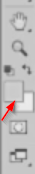

# Crop tool

The **Crop tool** allows you to select an area of an image, and discard everything outside this area. Its hotkey is `C`. Select an area, press `Enter`, and the rest will disappear.

You can also use it to resize your canvas. Just drag to the side you want enlarged and press `Enter`.

# Eyedropper tool

Press `I` to access the **Eyedropper tool**. With this tool, you can select a color from an image. It's very useful when you want to find out an exact color code.

Notice that when you click on your image, your foreground color from the left side will change. Double-click that and you will see its color code.

# Get dimensions with marquee tool

In CS6, you will see dimensions of your selection when using the **Marquee tool**. This is indeed very useful when you want to take measurements fast.

If you have CS5, you'll have to use the **Ruler tool**. It's underneath the Eyedropper, and with it, you drag lines and the measurements appear up top. Hold `Shift` while dragging to get a straight line. And once you're done, press the "Clear" button up top.