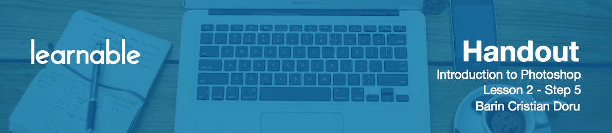
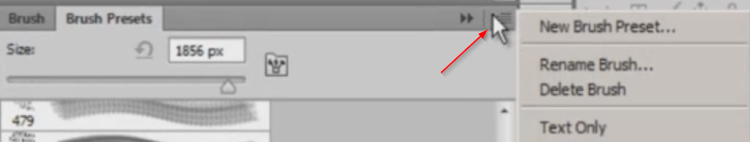
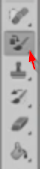

# Working with brushes

You can use **brushes** to draw something unique in your projects. Press `B` to select the Brush tool. Use `Shift+B` to scroll through the others.

These tools are a large part of Photoshop, and their possibilities are endless. You can spend years using brushes and still have much to learn. Lucky for us, web design doesn't require a massive amount of knowledge of these tools. So this is why you should just browse around and play with different options, so you can have an idea of how these work. What you should know at this point is that you can get a lot of free brushes on the Internet. 

# Options for brushes

Click this icon on the top right corner:

You will find multiple options regarding the way Photoshop displays your brushes, options to reset, save, delete or replace your current brush set. But this is not the object of the course, so let's move on.

# Color replacement tool

The **Color replacement tool** is great for changing the color of an object.

Just grab a picture, choose a foreground color and start brushing on the image. Depending on the colors, you may not get a perfect result. Make sure to have the "anti-alias" option checked and play with the tolerance. Some areas might need a bit more precision, so zoom in and lower the brush size.