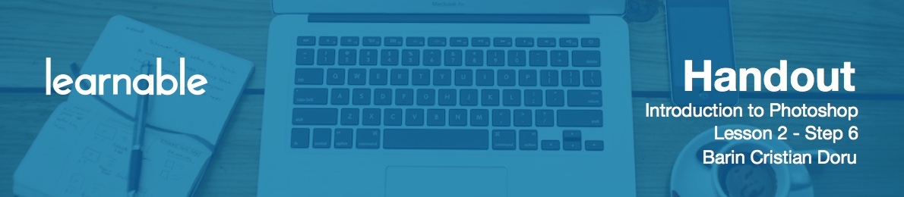

# Eraser tool and options

**The Eraser tool** lets you delete pixels as you drag across an image. When you select the Eraser tool, you have various options available in the toolbar.

* **Brush options** include the size of the eraser, hardness of edges, and various styles.
* **Mode** includes three options: "brush" (soft edges), "pencil" (hard edges), and "block" (square brush size).
* **Opacity**. 100% opacity erases pixels completely. 0 does not erase at all. 50 is semi-transparent. This can be useful when you want to gently erase a part of an image to get a certain effect.
* **Flow** determines how quickly the erasure is applied by the brush. Lower settings produce a more subtle effect.