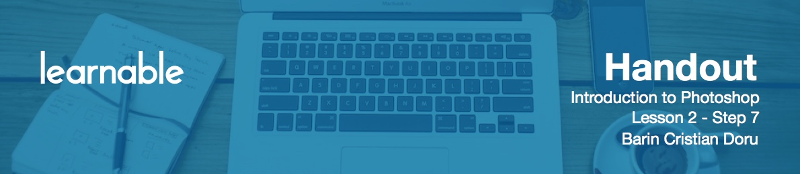
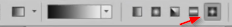

# Introduction to gradient tool

The **Gradient tool** creates a gradual blend between multiple colors. You can choose from preset gradient fills, create your own by adjusting the foreground and background colors or get one for free from the Internet. The tool's hotkey is `G`.

# Understanding gradient settings

Before you use a gradient, first make sure you have the right settings at the top.

Click this box to display a panel with all your current gradients. You can load more gradients by pressing the "Load" button. By using area at the bottom, you can manipulate your gradient in many ways until you achieve your desired result. The best way to learn is by using it.

# Working with gradient types

**Linear gradient** makes shades from the starting point to the ending point in a straight line.

**Radial gradient** makes shades from the starting point to the ending point in a circular pattern.

**Angle gradient** makes shades in a counter clockwise sweep around the starting point.

**Reflected gradient** mirrors the same linear gradient on either side of the starting point.

**Diamond gradient** shades from the middle to the outer corners of a diamond pattern.

The **opacity** adjusts the gradient's visibility.

To reverse the order of the colors in the gradient fill, select **Reverse**.

To create a smoother blend, with less banding, select **Dither**.

I know these options might seem like a complex tool, but gradients are easy and fun. I am sure you'll get them in no time.

# Working with paint bucket tool

The **Paint Bucket** tool is great when you want to fill an area with color. For example, make a selection, hit `G`, choose a color, and then click. You've just filled that selection with a Paint Bucket tool. Use the **tolerance** setting to adjust how the tool will target the area.