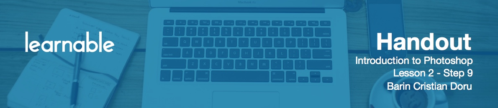

# Horizontal type tool

Press `T` and you'll have the **Horizontal type tool**.

You can create text layers in two ways. First, just click and start typing. The second option, click and drag to constrain the text to a certain area. In both ways, if you want to go to the next line, hit `Enter`. If you want to finish, use the numerical `Enter` from the right side of your keyboard, or press the check mark at the top.

If you want to discard your text, press `Escape`. To customize your text appearance, use the **Character panel** on the right side.

# Customize text appearance with character panel

You have multiple options here.

* **Font face** - click the dropdown to change it. To add more fonts, browse sites like [google.com/webfonts](http://google.com/webfonts) or [dafont.com](http://dafont.com). Download the file and paste it into the special folder containing the fonts. For Windows, that's `C:\Windows\Fonts` by default.
* **Font style** - can be narrow, regular, italic, bold, etc depending on your font.
* The **size** option is pretty straightforward: adjust it to make the text bigger or smaller.
* **Leading** is what is called `line-height` in CSS and refers to the height between two lines of text.
* **Letter spacing** can come in handy as well. Some fonts look good, but if you put more space between the letters it will look ever better.
* **Anti-aliasing** is also very important for the aspect of the text. Basically it smooths jagged edges in text by averaging the color of the pixels at a boundary. You can choose from crisp, smooth, sharp, and none, depending on the font, its size and color.