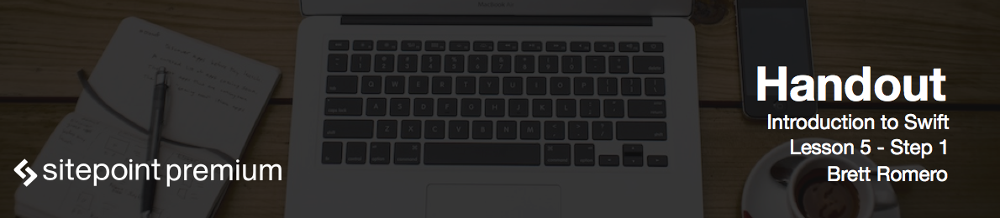

# Summary

Let's summarize what we've covered in this course.

- The first thing we did was create our project that started as a tap-based project.
- Then we set up the scenes here in main.storyboard.
- Then, we added a tab bar to our project.
- We also covered what is an MVC architecture (model, view controller).
- We discussed our activity class.
- We created an initializer inside of our class, which allowed us to create the activity data while creating the class.
- Then we moved into activity interactions and this got into our first scene where we allow the user to select an activity and start and stop that activity.
- Then we also created an IB Action for our start button.
- Then we got into our activity totals. This was our performance scene, which also had a table view. We created and IB outlet for this table view so it can reload that data each time the table view displayed.
- Then we got into deleting scenes in our performance view.
- Finally we capped it off with some error handling.

So building this app gives you a good foundation that you can then launch and create a wide variety of applications from here.

I hope you've enjoyed this course, and I've enjoyed teaching it. I wish you good luck in creating your next application!