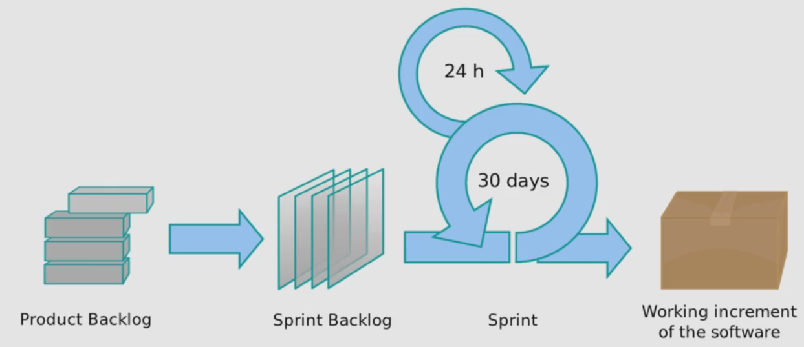

# Introduction

At this step we're going to be talking about **Scrum** project management.

# Overview of Scrum project management

Scrum is the oldest method that we've reviewed so far. It has its origins in the late 80s, early 90s. It's similar to Agile, but there's a couple of specific differences, which we're going to get into in a minute.

It works in incremental, iterative cycles, so you're working on something in each specific cycle and you're aiming to have a complete deliverable by the end of that cycle. It focuses on the team roles and team collaboration. Some of the roles are the product owner, the development team, the Scrum master. One of the interesting things about Scrum is that it's actually designed so that there isn't a role of project manager. The Scrum master resembles project manager but one of the things that comes with being a project manager is people management responsibilities, and the Scrum master doesn't have any of those responsibilities.

Scrum tries to take an empirical approach to project management. The idea is that you're maximizing the team's ability to deliver quickly and to respond to emerging requirements because customers are going to change their mind about what they want and need. This is called **requirements churn** in Scrum.

# Pros and cons of Scrum

In Scrum there's a big emphasis on working in sprints of 30 days, which does allow work to be completed quickly. But it doesn't always fits in a freelance workflow. There's a heavy focus on meetings, which can be a good thing because it can make sure everybody's on the same page and clear and it keeps everybody accountable. But it can also be a bad thing, because meetings can easily turn into a time-suck.

At the beginning of every sprint cycle a sprint planning meeting happens. Each sprint is usually 30 days, but may be shorter. At those meetings you decide what work is going to be done, you prepare the sprint backlog, discuss the details and set the time it's going to take to do that work.

There are also the daily meetings that are called **standups**. They are supposed to be so short that you can stand the whole time and not be uncomfortable - they're set to 15 minutes. The meeting starts at a set time in a set place no matter if everyone's there or not. Every team member answers three questions:

* What did I do yesterday that helped the development team meet the sprint goal?
* What will I do today to help the development team meet the sprint goal?
* Do I see any impediment that prevents me or the development team from meeting the sprint goal?

And then there is the end meeting, which is the sprint review in-retrospective, where you're discussing what went right, what went wrong, what you're going to do better next time.

So as you can see, that's a lot of meetings. If you're going to be working with a team that's doing Scrum and you're going to be participating in these meetings, then you need to factor in for that because 15 minutes a day tops for a meeting isn't very long, But, that's a little over an hour a week. So if a project is going to go for three months, then that would be from 12 to 15 hours that you need to account for in just the daily check-in meetings.

So, this tend to work really well for internal teams, but, if you're brought onto one of these teams as a freelancer, there might be downsides: it can be harder to make their workflow and schedule match yours.

# How Scrum applies to freelance work?

As we discussed before, sprints don't really work for freelancers. Putting 100% of your focus on one project is dangerous unless you're carefully planning for that. As far as your income goes, it's a strategic mistake because that's putting all of your eggs in one basket. What if something happens to this project? What if they run out of budget? And you had already dedicated, you knew that this was going to be, for example, three sprints of thirty days each so you cleared everything else off your schedule and said that this project was going to be your sole source of income for the next three months. Or what happens if the project get's axed half way through? The chances of that aren't necessarily high depending on the company and its background on the project, but it still might happen. So you need to be marketing and pitching yourself consistently, even if you currently have work.

Also as I already mentioned, if you're working with a Scrum-based team, you really need to make sure to factor in for the meeting time when you set your prices and cost estimates.